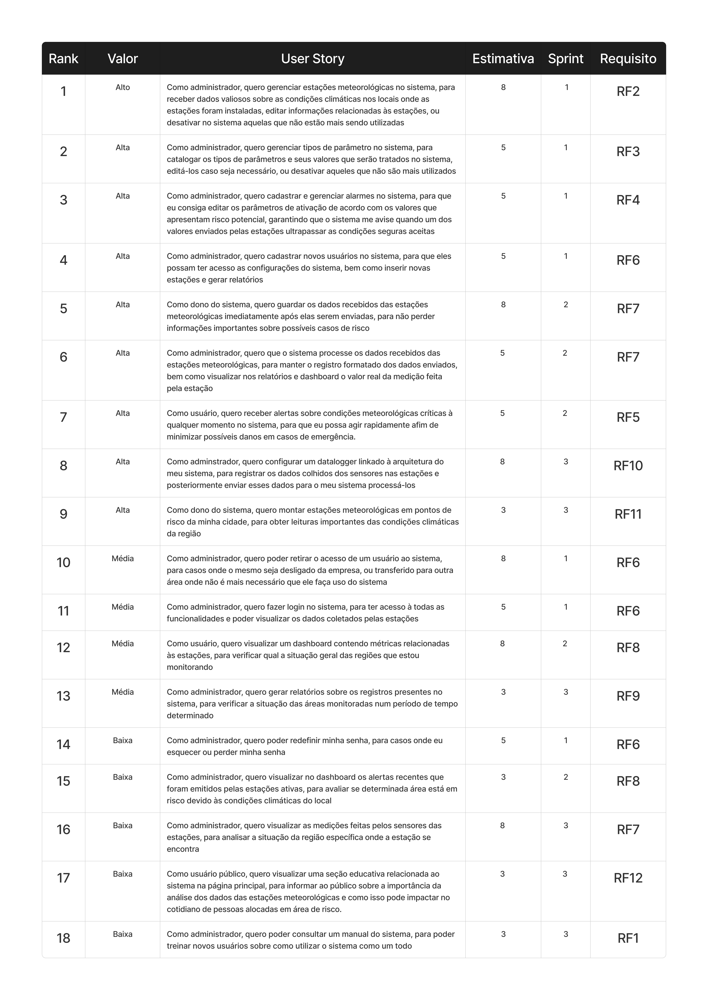
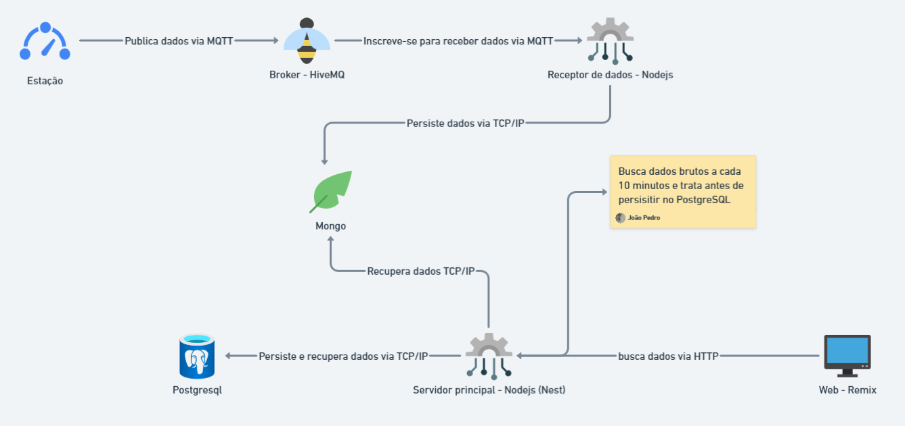

  <h1>Sistema para monitoramento de Estações Meteorológicas: Gaia🌿</h1>

## 🎯 Descrição do desafio

A Tecsus é uma empresa de tecnologia que cria soluções inteligentes para ajudar no uso mais eficiente de recursos como água, energia elétrica e gás, busca expandir sua atuação para o
monitoramento ambiental. O desafio consiste em desenvolver uma solução completa
para estações meteorológicas de baixo custo, capazes de medir direção e
velocidade do vento, índice pluviométrico, umidade, temperatura e pressão. Os
dados coletados periodicamente devem ser enviados a um servidor para tratamento
e exibição em um portal com relatórios e dashboards. Este portal também deverá
ter um componente educacional, demonstrando os conceitos matemáticos por trás
dos parâmetros e a relevância do monitoramento ambiental para a prevenção de
desastres naturais.

## 📖 Backlog do Produto

---

## 🗓️ Cronograma e Sprints do projeto

| Sprint |    Período da Sprint    |                                       Link para a documentação                                       |             Link para o vídeo no Youtube             |     Status      |
| :----: | :---------------------: | :--------------------------------------------------------------------------------------------------: | :--------------------------------------------------: | :-------------: |
|   01   | 08/09/2025 a 28/09/2025 | [Relatório](https://github.com/CtrI-Alt-Del/gaia/blob/main/documentation/sprints/sprint-1-report.md) | [Vídeo](https://drive.google.com/file/d/1NVJC_6bO8k0GkvUksZzdhMamQl-jTsjU/view?usp=sharing) | Concluida ✅ |
|   02   | 06/10/2025 a 26/10/2025 | [Relatório](https://github.com/CtrI-Alt-Del/gaia/blob/main/documentation/sprints/sprint-2-report.md) | [Vídeo](https://drive.google.com/file/d/1KP6k8Ungu-_iwjBWEmg2bVdYCxLGmyKe/view?usp=sharing) | Concluida ✅ |
|   03   | 03/11/2025 a 23/11/2025 | [Relatório](https://github.com/CtrI-Alt-Del/gaia/blob/main/documentation/sprints/sprint-3-report.md) | [Vídeo](https://drive.google.com/file/d/1eh2pXoVU4pVcnfh9B_E3i682H4exiIvz/view?usp=sharing) | Em andamento 🚧 |

## 🛠️ Tecnologias

O sistema foi desenvolvido utilizando um conjunto de tecnologias para garantir
coleta, processamento, persistência e disponibilização dos dados meteorológicos:

- **[HiveMQ](https://www.hivemq.com/)** → Broker MQTT responsável por gerenciar
  a publicação e assinatura de mensagens.

- **[Node.js](https://nodejs.org/)** → Plataforma usada tanto para o receptor de
  dados quanto para o servidor principal, garantindo alta performance na
  ingestão e tratamento das informações.

- **[NestJS](https://nestjs.com/)** → Framework sobre Node.js que estrutura o
  servidor principal, oferecendo modularidade, injeção de dependência e
  escalabilidade.

- **[MongoDB](https://www.mongodb.com/)** → Banco de dados NoSQL utilizado para
  persistir os dados brutos recebidos das estações.

- **[PostgreSQL](https://www.postgresql.org/)** → Banco de dados relacional
  utilizado para armazenar os dados processados e otimizados para consultas.

- **[Redis](https://www.postgresql.org/)** → Banco de dados não relacional
  utilizado para caching de dados e prover o padrão pub/sub do Bull.

- **[Bull](https://github.com/OptimalBits/bull)** → Biblioteca para Node.js extremamente popular usada para gerenciar filas de processamento (queues) em background.

- **[Astro](https://astro.build/)** → Framework web moderno focado no Frontend e na entrega de páginas estáticas ultra-rápidas e otimizadas. 

- **[Prisma](https://www.prisma.io/)** → ORM (Object-Relational Mapper) que
  facilita a interação com os bancos de dados, como PostgreSQL e MongoDB.

- **[Remix](https://remix.run/)** → Framework web usado para o front-end,
  responsável por disponibilizar os dados ao usuário final via HTTP.

- **[Tailwind CSS](https://tailwindcss.com/)** → Framework CSS utility-first
  para a estilização da interface do usuário.

- **[Docker](https://www.docker.com/)** → Plataforma de contêineres utilizada
  para empacotar e executar a aplicação em ambientes isolados, facilitando o
  deploy.

- **[Terraform](https://www.terraform.io/)** → Ferramenta de infraestrutura como
  código (IaC) para automatizar o provisionamento e gerenciamento da
  infraestrutura da aplicação.

## 🏢 Arquitetura do Projeto

## 📁 Estrutura do Repositório

O projeto segue uma arquitetura de microserviços com separação clara de
responsabilidades:

- **`gaia-server/`**: API REST desenvolvida em NestJS que gerencia a coleta,
  processamento e armazenamento dos dados meteorológicos
- **`gaia-web/`**: Interface web desenvolvida em Remix que disponibiliza
  dashboards e relatórios para os usuários
- **`documentation/`**: Documentação técnica e relatórios de progresso do
  projeto

## ▶️ Como executar o projeto

Acesse os repositórios **`gaia-server/`** e **`gaia-web/`** e clone ambos na sua máquina, verifique no **`readme.md`** de cada repositório como rodar o projeto e quais rotas acessar.

## 📚 Documentação do projeto

- [DoR (Definition of Ready)](https://github.com/CtrI-Alt-Del/gaia/blob/main/documentation/dor.md)
- [DoD (Definition of Done)](https://github.com/CtrI-Alt-Del/gaia/blob/main/documentation/dod.md)
- [Estratégia de branches](https://github.com/CtrI-Alt-Del/gaia/blob/main/documentation/branch-stragery.md)
- [Padrão de commit](https://github.com/CtrI-Alt-Del/gaia/blob/main/documentation/commit-pattern.md)
- [Gestão da automação](https://github.com/CtrI-Alt-Del/gaia/blob/main/documentation/gestao-da-automação.md)
- [Gestão do processo](https://github.com/CtrI-Alt-Del/gaia/blob/main/documentation/gestao-do-processo.md)
- [Gestão do conhecimento](https://github.com/CtrI-Alt-Del/gaia/blob/main/documentation/gestao-do-conhecimento.md)

## 👷🏻 Equipe

|                                    Foto                                    |          Nome           |    Função     |                                                                            Github                                                                            |                                                                                              Linkedin                                                                                               |
| :------------------------------------------------------------------------: | :---------------------: | :-----------: | :----------------------------------------------------------------------------------------------------------------------------------------------------------: | :-------------------------------------------------------------------------------------------------------------------------------------------------------------------------------------------------: |
|            |   Joao Pedro Carvalho   | Scrum Master  |            |  |
|     |  Joao Gabriel Oliveira  | Product Owner |     |    |
|  |  Caique Péricles Silva  |   Dev Team    |  |                               |
|              |    Gabriel Oliveira     |  Dev Team   |              |                     |
|                |  Kauan Fonseca do Vale  |   Dev Team    |                |                        |
|                |     Thiago Martins      |   Dev Team    |                |                         |
