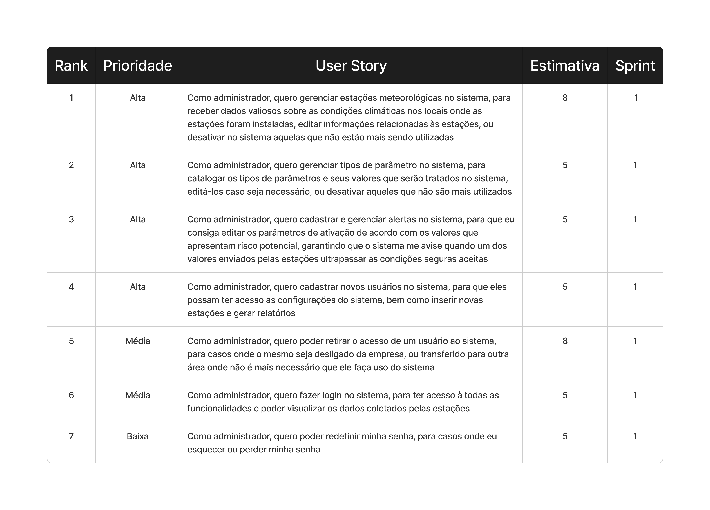

# Sprint - 1️⃣

## Requisitos realizados nessa sprint ✨

- **Gerenciamento de Estações:**
  - Cadastro de estações, gerenciamento de sensores, localização das áreas monitoradas
- **Gerenciamento de Parâmetros:**
  - Funcionalidades completas de criação, leitura, atualização e exclusão, garantindo que os usuários possam cadastrar novos registros, consultar informações existentes, modificar dados já armazenados e remover itens de forma segura e controlada.
- **Gerenciamento de Alarmes:**
  - Funcionalidades completas de criação, leitura, atualização e exclusão.
- **Geração de Alertas:**
  - Geração de alertas automaticamente com base em condições climáticas específicas.
- **Gerenciamento de Usuários:**
  - Cadastro de usuários, desativação, login e redefinição de senhas, controle de acesso para ações sensíveis (somente admin master)

## User Stories realizados nessa sprint 📖

## Critérios de aceitação para cada User Story 📒

### US01

- A interface deve listar todas as estações cadastradas com suas principais informações (Código, Nome, Localização, ativa/inativa).
- O formulário de criação/edição deve permitir a inserção de nome, localização e status da estação.
- Deve ser possível adicionar ou excluir sensores no registro de uma estação, bem como gerenciar os seus parâmetros
- Uma estação deve poder ser desativada ao invés de excluída do sistema, deve ser precedida por uma confirmação.
- Todas as operações (Criação, Leitura, Atualização, Desativação) devem ser refletidas no banco de dados.

### US02

- O sistema deve listar todas os parâmetros cadastrados com suas principais informações (Nome, Sigla, Unidade de medida, Fator, Offset).
- O formulário de criação/edição deve permitir a inserção/modificação de todos os campos citados.
- Um parâmetro deve poder ser desativado ao invés de excluído do sistema, deve ser precedida por uma confirmação.
- Todas as operações (Criação, Atualização, Desativação) devem ser refletidas no banco de dados.

### US03

- O sistema deve listar todas os alertas cadastrados com suas principais informações (Nome, Parâmetro relacionado, Condições de ativação, e Mensagem do alerta).
- O formulário de criação/edição deve permitir a inserção/modificação de todos os campos citados.
- Um alerta deve poder ser desativado no sistema, precedido por uma confirmação.
- Todas as operações (Criação, Atualização, Desativação) devem ser refletidas no banco de dados.

### US04

- O sistema deve listar todos os usuários cadastrados no sistema
- O usuário deve poder modificar as informações da sua conta através da página de perfil
- Somente a conta ADM principal deve poder criar usuários
- Todas as operações (Criação, Edição) devem ser refletidas no banco de dados.

### US05

- Somente a conta ADM principal deve poder desativar usuários
- Deve ser solicitada uma confirmação para a desativação da conta
- Um usuário com a conta desativada não deve ter acesso ao sistema com as suas credenciais
- A operação de desativação do usuário deve ser refletida no banco de dados.

### US06

- O usuário deve realizar o login utilizando email e senha
- Para acessar o sistema, ele deve confirmar o código de acesso enviado ao email dele

### US07

- Deve ser enviado um email para o usuário contendo o link para redefinir a senha
- O usuário deve digitar a nova senha e confirmá-la
- Após a redefinição, ele deve ser redirecionado para a tela de login

### Tasks realizados nessa sprint

## Gráfico Burndown 📈

## Slides para apresentação 🎞️

**<a href="" _target="blank" download="sprint-1-apresentacao">Clique para acessar a apresentação no Canva</a>**