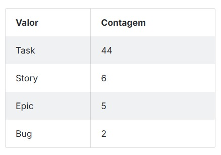
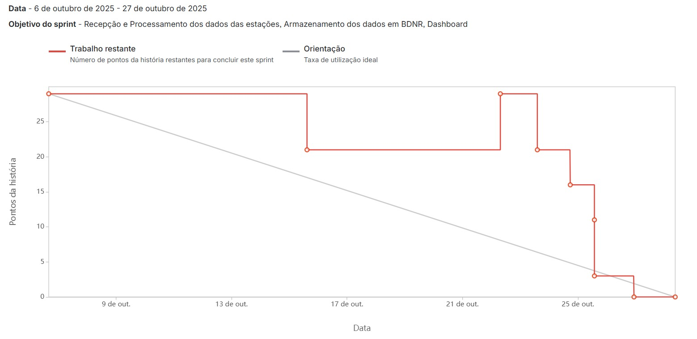

# Sprint - 2️⃣

## Requisitos realizados nessa sprint ✨

- **Recepção de Dados:**
  - Implementação de endpoints e serviços para receber e armazenar imediatamente os dados brutos enviados pelas estações meteorológicas.
- **Processamento e Formatação de Dados:**
  - Rotinas para processar os dados brutos, aplicando os parâmetros de calibração (fator, offset) e formatando-os para consulta em relatórios e dashboards.
- **Sistema de Notificação de Alertas:**
  - Geração e envio de notificações em tempo real para os usuários quando os dados processados atingem os limiares críticos definidos nos alarmes.
- **Dashboard de analise Meteorologica**
  - Tela inicial para o usuário visualizar as métricas principais e a situação geral das regiões que ele monitora.

## User Stories realizados nessa sprint 📖

| Rank | Prioridade | User Story | Estimativa | Sprint |
| :--- | :--- | :--- | :--- | :--- |
| 8 | Alta | Como dono do sistema, quero guardar os dados recebidos das estações meteorológicas imediatamente após elas serem enviadas, para não perder informações importantes sobre possíveis casos de risco | 8 | 2 |
| 9 | Alta | Como administrador, quero que o sistema processe os dados recebidos das estações meteorológicas, para manter o registro formatado dos dados enviados, bem como visualizar nos relatórios e dashboard o valor real da medição feita pela estação | 5 | 2 |
| 10 | Alta | Como usuário, quero receber alertas sobre condições meteorológicas críticas à qualquer momento no sistema, para que eu possa agir rapidamente afim de minimizar possíveis danos em casos de emergência. | 5 | 2 |
| 11 | Média | Como usuário, quero visualizar um dashboard contendo métricas relacionadas às estações, para verificar qual a situação geral das regiões que estou monitorando | 8 | 2 |
| 12 | Baixa | Como administrador, quero visualizar no dashboard os alertas recentes que foram emitidos pelas estações ativas, para avaliar se determinada área está em risco devido às condições climáticas do local | 3 | 2 |

## Critérios de aceitação para cada User Story

### US08

- O sistema deve possuir um endpoint de API para receber os dados das estações (ex: via HTTP POST ou MQTT).
- Os dados recebidos devem ser armazenados em um banco de dados "bruto" (raw data) imediatamente após o recebimento, com o mínimo de processamento.
- Cada registro de dado deve estar associado à estação (US01) que o enviou e conter um timestamp (data e hora) do recebimento.
- O sistema deve registrar logs de sucesso ou falha na ingestão de dados.

### US09

- Deve existir uma rotina (ex: um serviço de background ou job) que leia os dados brutos da US08.
- A rotina deve aplicar os cálculos de "Fator" e "Offset" (cadastrados na US02) para cada parâmetro medido, convertendo o valor bruto em valor real.
- Os dados processados e formatados (valor real, unidade de medida) devem ser salvos em uma tabela ou coleção otimizada para consultas de leitura (relatórios, dashboards).
- O sistema deve ser capaz de lidar com dados faltantes ou malformados durante o processamento.

### US10

- O sistema deve monitorar os dados processados (da US09) continuamente.
- Ao identificar que um dado atende às "Condições de ativação" de um Alarme (definido na US03), um alerta deve ser gerado.
- O alerta gerado deve disparar uma notificação (ex: e-mail, notificação push ou SMS) para os usuários.
- A notificação deve conter a "Mensagem do alerta" (da US03) e as informações relevantes (estação, valor medido).
- Deve haver um registro de todos os alertas enviados no banco de dados.

### US11

- O usuário, ao logar, deve ser direcionado para um dashboard.
- O dashboard deve exibir widgets com as principais métricas (ex: temperatura, umidade, nível de chuva) das estações que ele tem permissão para ver.
- Deve haver um componente (mapa ou lista) que mostre a situação geral (ex: Normal, Atenção, Risco) de cada região monitorada.
- Os dados exibidos no dashboard devem ser atualizados automaticamente em intervalos regulares (ex: a cada 1 minuto).

### US12

- O administrador deve ter uma seção/widget em seu dashboard principal dedicada a "Alertas Recentes".
- Esta seção deve listar os últimos alertas gerados (da US10), ordenados do mais novo para o mais antigo.
- A lista deve exibir informações-chave: tipo de alerta, estação de origem, horário e status (ex: "Novo").
- O administrador deve poder clicar em um alerta para ver mais detalhes (se aplicável).
- A lista deve ser atualizada em tempo real à medida que novos alertas são gerados.

## Tasks realizados nessa sprint

## Gráfico Burndown 📈

## Slides para apresentação 🎞️

**<a href="../../media/slides_sprint_2.pdf" _target="blank" download="sprint-2-apresentacao">Clique para acessar a apresentação no Canva</a>**